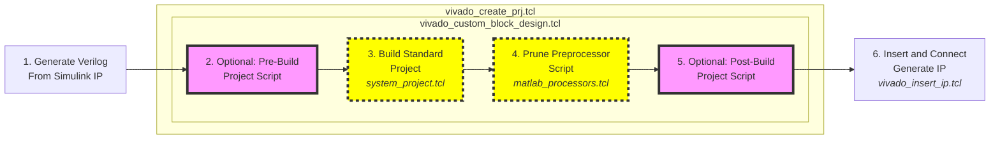

# HDL Workflow

!!! warning This content is meant for developers or advanced users and is not meant for general consumption.

This page discusses the HDL targeting support from the perspective of the HDL source repo and HDL-Coder itself. It is not necessary for users to understand these details but for those managing the toolbox or developers extending support to new platforms this information is valuable.

This page assumes a basic understanding of MathWork's [HDL Workflow Advisor (HWA)](https://www.mathworks.com/help/hdlcoder/ug/overview-of-workflows-in-hdl-workflow-advisor.html) and its different steps for creating IP, creating a HDL project, and generating a bitstream. 

## HDL Repo Preparation

When the toolbox is built it will clone a specific branch of the [ADI HDL repo](github.com/analogdevicesinc/hdl) and apply certain changes to support the [IP-Core Generation HDL-Coder](https://www.mathworks.com/discovery/ip-core-generation.html) workflow. However, with the current flow there are minimal changes required which makes moving between release simpler. This is currently done by simply replacing certain TCL scripts within the HDL repo. 

Creation of the toolbox, cloning of the HDL source, and applying the necessary update is driven through a Makefile in the **CI/scripts** folder. The toolbox is built in source form with the **build** as follows:

```bash
make -C CI/scripts build
```
After the above command completes the HDL source will be in place with necessary changes.

The changes primarily required of the HDL source are interceptions of the build functions (procs) to skip synthesis when building a project. This is done by inserting environmental variable checks into the [adi_project_xilinx.tcl](https://github.com/analogdevicesinc/TransceiverToolbox/blob/master/CI/scripts/adi_project_xilinx.tcl#L138) script. At build time these environmental variables are set and will prevent synthesis. This way an HDL project can be built, then handed off to HDL-Coder for IP insertion and eventual synthesis.

HDL-Coder is limited to only interact with Vivado or Quartus. Therefore, it cannot leverage the makefiles as traditionally used to build HDL projects in the HDL repo. HDL-Coder and the authored scripts in the toolbox use the [TCL flow](https://wiki.analog.com/resources/fpga/docs/build#xilinx_auto_tcl_build) normally recommended for just Windows users. This is used on all platforms (Windows and Linux) to support HDL code-generation and integration with ADI toolboxes.

## HDL-Coder IP Core Generation Flow

The orchestration of Vivado and calling of specific TCL scripts is managed through MathWork's [HWA](https://www.mathworks.com/help/hdlcoder/ug/overview-of-workflows-in-hdl-workflow-advisor.html). HWA generates HDL (Verilog is currently the only supported language) for specific Simulink blocks, calls a number of TCL scripts maintained by ADI to build a project and make room for IP, then inserts that IP and calls synthesis. This will be discussed from HWA and the generated scripts it creates. This is detailed from the scripting perspective first in the figure below:


<center>Figure 1: Details IP-Core Generation flow with Toolbox</center>

At a high-level there are six main steps, two of which are optional. From the far left stage "Generate Verilog From Simulink IP" occurs in Stage 3 "HDL Code Generation" within HWA as outlined in red below. This will create Verilog within the defined project folder and then be copied into the full HDL project later on.

<figure markdown>
{ width=80% }
  <figcaption>Figure 2: HDL Workflow Advisor IP verilog generation.</figcaption>
</figure>

Within the largest central block of the flowchart labeled **vivado_create_prj.tcl** are all the core steps related the HWA Step 4.1, where the reference HDL project folder is built and necessary cores and nets removed to make room for IP from Simulink generated in HWA Step 3. This stage is highlighed in the figure below. The purple boxes are optional stages that are used in certain customized examples when additional work is required to prepare a reference design. The [Frequency Hopping example](https://github.com/analogdevicesinc/TransceiverToolbox/tree/master/trx_examples/targeting/frequency-hopping) leverages these stages. Once the project is prepared the IP is inserted and bitstream generated, which occurs through HWA Step 4.3.

<figure markdown>
{ width=80% }
  <figcaption>Figure 3: HDL Workflow Advisor project generation step.</figcaption>
</figure>


### Vivado Project Perspective

Based on the flow in Figure 1, there are a three main states the HDL reference design enters from a high level. These states will be discussed more from the Vivado project perspective, specifically the data path of an FMComms2 project. Other HDL projects will be similar.

The first state is just the initial creation of the standard unmodified block design. Looking at Figure 4, the three IPs show the dataflow from the interface core (axi_ad9361), through the ADC FIFO, and finally into the pack core. In orange are the data buses and valid signal highlighted. These are important since the generated IP needs to be inserted where these nets are connected. Therefore, in the second state of the design these nets are removed to make room from the new IP.

<figure markdown>
{ width=80% }
  <figcaption>Figure 4: RX path in unmodified standard reference design.</figcaption>
</figure>

Once the IP is inserted into the project by HDL-Coder it is connected to the FIFO and pack cores where the nets in Figure 4 were highlighted. The new inserted and connected IP can be see in Figure 5.

<figure markdown>
{ width=80% }
  <figcaption>Figure 5: RX path with inserted IP from HDL-Coder.</figcaption>
</figure>

The connecting of the IPs and insertion are entirely managed by HDL-Coder and through the [add_io_ports](https://github.com/analogdevicesinc/TransceiverToolbox/blob/master/hdl/vendor/AnalogDevices/+AnalogDevices/add_io_ports.m) function and supporting [JSON port definition file](https://github.com/analogdevicesinc/TransceiverToolbox/blob/master/hdl/vendor/AnalogDevices/+AnalogDevices/ports.json).

### Generated TCL Scripts


The following scripts outlined in the figure above have certain purposes:

- **vivado_create_prj.tcl**: This is the first TCL scripted called in Stage 4 of HWA and is responsible for setting up a standard reference design and trimming nets and IPs to make room for IP from Simulink
- **vivado_custom_block_design.tcl**: This is a carbon copy of the **system_project_rxtx.tcl** script and is called by **vivado_create_prj.tcl**. This script will call [adi_make.tcl](https://wiki.analog.com/resources/fpga/docs/build#xilinx_auto_tcl_build), the correct system_project.tcl file, and finally matlab_processor.tcl. It will optionally call the pre/post processor TCL scripts.
- **vivado_insert_ip.tcl**: This script is fully generated by MATLAB based on the [add_io](https://github.com/analogdevicesinc/TransceiverToolbox/blob/master/hdl/vendor/AnalogDevices/+AnalogDevices/add_io.m) definitions in MATLAB to insert the custom IP into the prepared reference design.