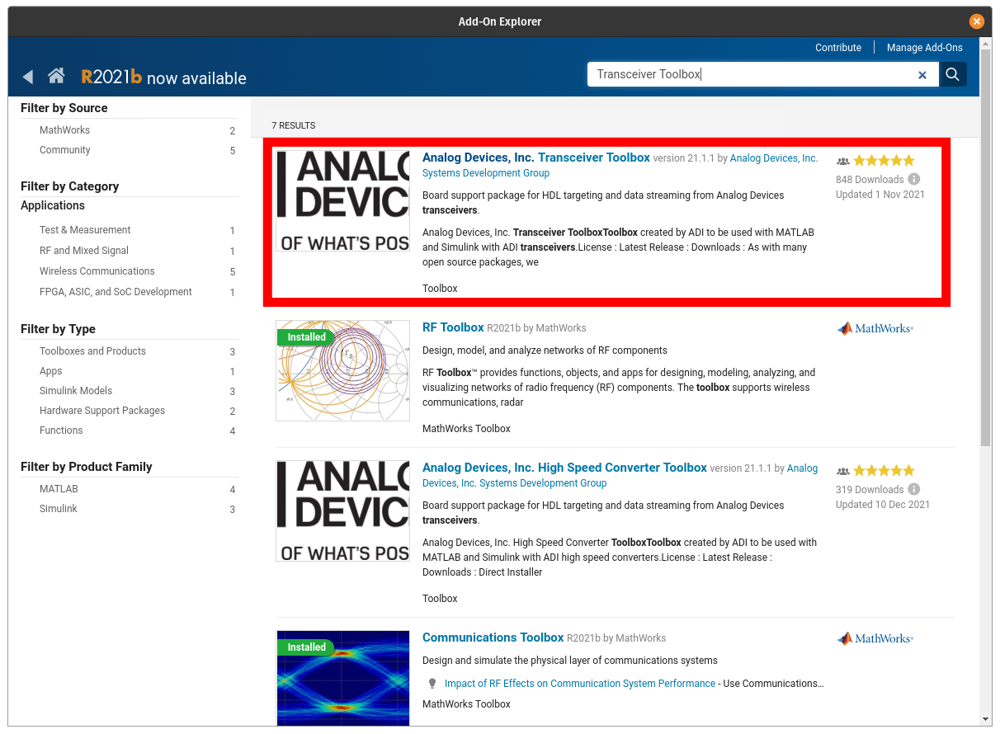
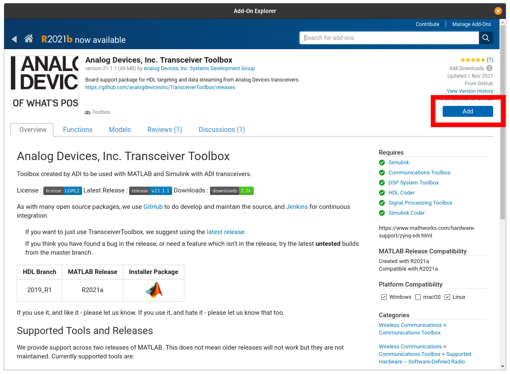

# Installation

## Dependencies

The toolbox has different dependencies based on the features required. These are broken down into the base dependencies for data stream and control, and HDL code generation.

The base dependencies for the toolbox requires libiio and the libiio MATLAB bindings. There are three options for this install with different required MathWorks Toolboxes:

- [Communications Toolbox Support Package for Xilinx Zynq-Based Radio](https://www.mathworks.com/help/supportpkg/xilinxzynqbasedradio/index.html)
    - Communications Toolbox
    - Signal Processing Toolbox™
    - DSP System Toolbox™
- [Communications Toolbox Support Package for Analog Devices ADALM-Pluto Radio](https://www.mathworks.com/help/supportpkg/plutoradio/index.html)
    - Communications Toolbox
    - Signal Processing Toolbox™
    - DSP System Toolbox™
- [libiio MATLAB Binding Standalone Installer (R2021b+)](https://github.com/mathworks/buildroot/releases/download/mathworks_zynq_R21.2.0/libiio.mlpkginstall)
    - Signal Processing Toolbox™

### HDL Generation Support

To leverage HDL-Coder and the reference designs with the toolbox requires the following components:

- Xilinx Vivado 2019.1
- Xilinx SDK 2019.1
- Simulink
- [HDL-Coder™](https://www.mathworks.com/products/hdl-coder.html)
- [HDL Coder™ Support Package for Xilinx Zynq Platform](https://www.mathworks.com/matlabcentral/fileexchange/40447-hdl-coder-support-package-for-xilinx-zynq-platform)

## Transceiver Toolbox Install

The Transceiver Toolbox itself can be installed either from:

- [MATLAB's Add-On Explorer](https://www.mathworks.com/products/matlab/add-on-explorer.html) 
- [GitHub Releases page](https://github.com/analogdevicesinc/TransceiverToolbox/releases).

!!! warning "MATLAB Versions"
    Before installing Transceiver Toolbox check the [Release Page](https://github.com/analogdevicesinc/TransceiverToolbox/releases) to check for the lasted supported of MATLAB. The latest version is the one which is available in [Add-on Explorer](https://www.mathworks.com/products/matlab/add-on-explorer.html), since Add-On Explorer does not currently support hosting multiple versions. If ypu have an older release of MATLAB, download the MLTBX installer from matching release on the [Release Page](https://github.com/analogdevicesinc/TransceiverToolbox/releases).

### Add-On Explorer Walkthrough

To install the toolbox from within MATLAB using the Add-On Explorer, first launch the Explorer from MATLAB's Home tab:

Search for the toolbox:

<!--  -->

Select Transceiver Toolbox from results:

<!--  -->

Select add:

<!--  -->
